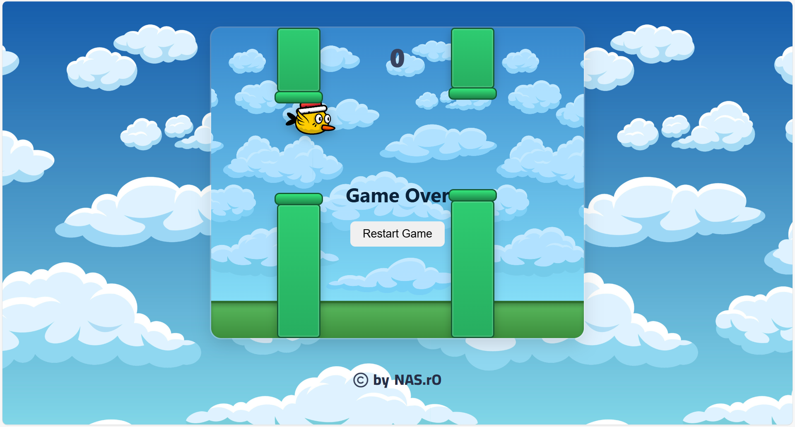
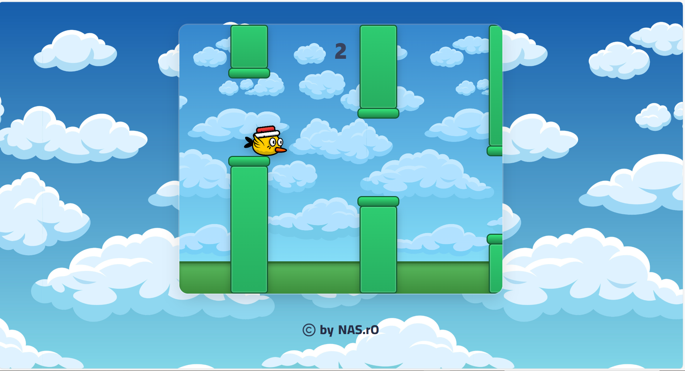

# Flappy Bird - React

A **Flappy Bird clone** built entirely with **React**.  
This project recreates the classic arcade-style game where the goal is to guide a bird through moving pipes without crashing.  

It is designed to demonstrate:
- How to use **React components** to structure a game.
- Handling animations and movement with **React hooks** and **state**.
- Managing game loops and collision detection in a browser environment.

---

##  Demo

Example:  

---

## 🚀 Features
- ✅ Responsive game canvas (works on different screen sizes).  
- ✅ Smooth animations with **requestAnimationFrame**.  
- ✅ Score counter that increases for every pipe passed.  
- ✅ Restart functionality (play again without refreshing).  
- ✅ Simple, clean React structure for learning and extension.  

---
## Running APP

first you must install node js from here : https://nodejs.org/fr/download
then press in your keyboard to windows + R then terminal will open then write 
this instructions into your terminal :

✅ Method 1: Run in Development Mode
# 1. Clone the repository
git clone https://github.com/abd123482/Flappy-Bird-Game.git

# 2. Go inside the project
cd Flappy-Bird-Game

# 3. Install dependencies
npm install   

# 4. Start the React development server
npm run dev  

✅ Method 2: Run project that already exists on your computer
# 1. Go inside the project folder (replace with your path)
cd path/to/Flappy-Bird-Game

---
